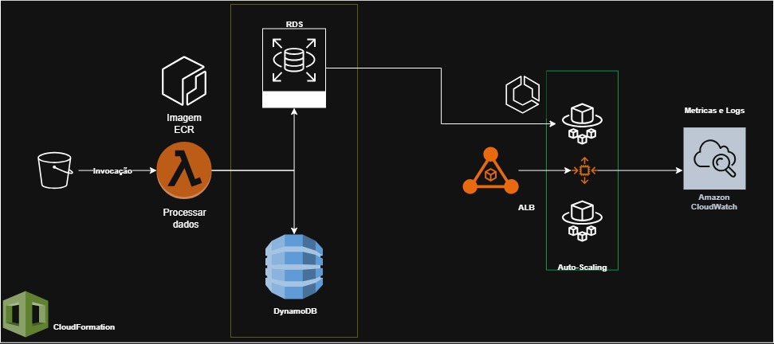

# 🚀 Arquitetura AWS 

## 📌 Descrição Geral

Este projeto demonstra uma arquitetura baseada em serviços gerenciados da AWS com foco em processamento de dados, armazenamento, escalabilidade e monitoramento.

---

## 🧱 Componentes da Arquitetura

### 📁 Amazon S3
- Armazena o arquivo de entrada (`.csv`).
- Quando o arquivo é enviado para o bucket, dispara a **AWS Lambda** via evento.

### 🐳 AWS Lambda com Docker (ECR)
- Utiliza uma imagem Docker armazenada no **Amazon ECR**.
- Responsável por:
  - Processar o arquivo `.csv`.
  - Converter o conteúdo para os formatos **Parquet** e **JSON**.
  - Enviar os dados convertidos para os bancos:
    - **Parquet** → **Amazon RDS**
    - **JSON** → **Amazon DynamoDB**

### 🛢️ Amazon RDS
- Banco relacional utilizado para armazenar os dados convertidos em **Parquet**.

### 📦 Amazon DynamoDB
- Banco NoSQL utilizado para armazenar os dados convertidos em **JSON**.

---

## 🌐 Camada de Apresentação - ECS + Grafana

### ⚖️ Application Load Balancer (ALB)
- Controla e direciona o tráfego para os containers no **ECS**.
- Só permite acesso às instâncias por meio do próprio ALB (via regras de **Security Groups**).

### 🚀 Amazon ECS com Fargate
- Executa containers com a imagem do **Grafana**.
- Automatizado para iniciar novas instâncias conforme necessário.

### 🔁 Auto Scaling
- Monitora o uso de **CPU**.
- Escala horizontalmente (mais containers) com base em métricas.
- Utiliza **Amazon CloudWatch** para:
  - Coletar métricas de uso.
  - Acionar as políticas de escalonamento.

---

## 📊 Monitoramento - Amazon CloudWatch
- Coleta métricas de uso de CPU.
- Envia informações ao Auto Scaling.
- Permite gerar logs e dashboards de monitoramento.

---

## 🛠️ Provisionamento - AWS CloudFormation
- Toda a infraestrutura é definida como código.
- Facilita a replicação e o versionamento do ambiente.

---

## 📎 Tecnologias Utilizadas

- AWS S3
- AWS Lambda + ECR
- Amazon RDS
- Amazon DynamoDB
- Amazon ECS + Fargate
- Application Load Balancer (ALB)
- Auto Scaling
- Amazon CloudWatch
- Grafana
- CloudFormation